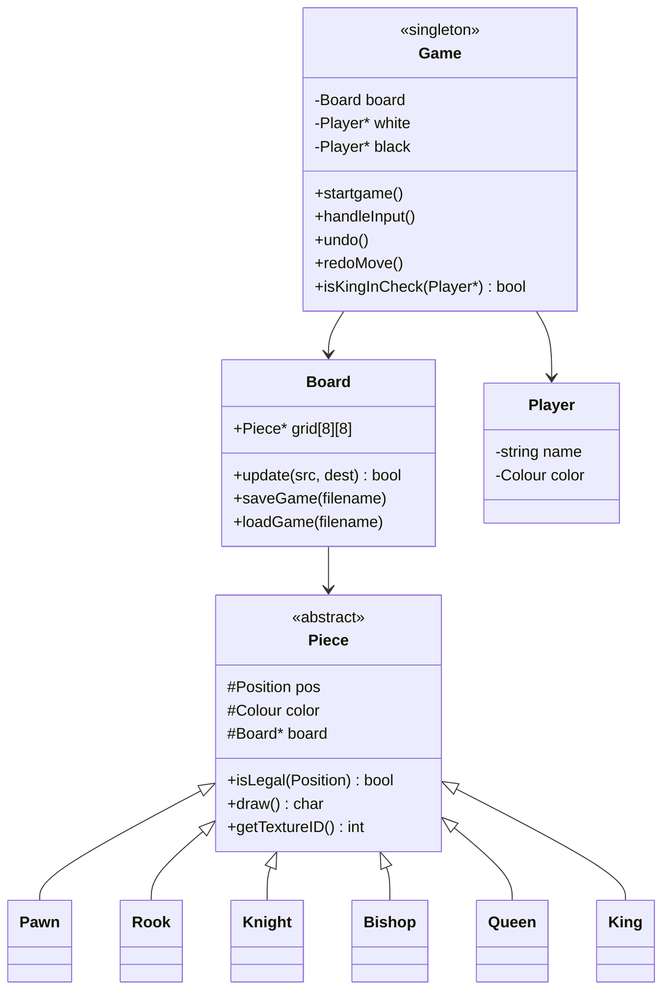

# CHESS-GAME-ON-RAYLIB
<div align="center">

# ♟️ Chess — Object-Oriented C++ Edition

### A fully playable two-player chess engine built from scratch in C++ with raylib graphics

     &nbsp;&nbsp;&nbsp;
     


</div>

---

## 📖 About

**Chess** is a two-player desktop chess game rendered with **raylib** and built on a clean, extensible **object-oriented C++ architecture**. Every piece is its own polymorphic class implementing real chess movement rules — check, checkmate, and stalemate detection, save/load, undo/redo, and full move replay are all built in.

> 💡 Built as an OOP systems project — designed to showcase inheritance, polymorphism, encapsulation, and the Singleton pattern in a real, playable application.

---

## ✨ Features

| | |
|---|---|
| 🎮 **Full 2-Player Chess** | Complete legal move validation for every piece type |
| 👑 **Check / Checkmate / Stalemate** | Real-time game-state detection with on-screen banners |
| 💾 **Save & Load** | Persist a game to `saves.txt` and resume later |
| ↩️ **Undo / Redo** | Step backward and forward through move history |
| ⏪ **Replay Mode** | Scrub through an entire finished game move-by-move |
| 🖼️ **Textured Board** | Custom piece sprites rendered via `TextureManager` |
| 🧠 **Turn & Status Panel** | Live sidebar showing current turn, players, and game state |

---

## 🖥️ Preview

```
┌───────────────────────────────┐   ┌───────────────────────┐
│                                 │   │      CHESS GAME       │
│      8x8 Interactive Board      │   │  Current Turn: WHITE  │
│      with live piece sprites    │   │  Status: In Progress  │
│      and move highlighting      │   │  Player 1: You        │
│                                 │   │  Player 2: Rival      │
│                                 │   │ [S]ave  [L]oad         │
│                                 │   │ [U]ndo  [R]edo         │
└───────────────────────────────┘   └───────────────────────┘
```

---

## 🏗️ Architecture

The project follows a clean OOP hierarchy — one abstract `Piece` base class, six concrete piece types, and a `Game` singleton that orchestrates everything.



**Core classes**

| Class | Responsibility |
|---|---|
| `Piece` | Abstract base — shared movement geometry (`isHorizontal`, `isDiagonal`, path-clear checks) |
| `Pawn / Rook / Knight / Bishop / Queen / King` | Concrete pieces, each implementing its own `isLegal()` |
| `Board` | Owns the 8×8 grid, applies moves, serializes/deserializes game state |
| `Player` | Holds a player's name and colour |
| `Game` | Singleton controller — game loop, input, turn logic, check/checkmate detection, undo/redo/replay |
| `TextureManager` | Loads and serves all piece sprite textures to raylib |
| `Position` / `Colour` | Small value types used throughout the engine |

---

## ⌨️ Controls

| Key | Action |
|---|---|
| `Mouse Click` | Select a piece, then click a destination to move |
| `S` | Save current game |
| `L` | Load saved game |
| `U` | Undo last move |
| `R` | Redo move |
| `N` | Start a new game (from menu) |
| `←` / `→` | Step backward / forward through replay |

---

## 🚀 Getting Started

### Prerequisites
- C++17-compatible compiler (MSVC, g++, or clang++)
- [raylib](https://www.raylib.com/) installed and linked

### Build & Run

```bash
# Example using g++ (adjust raylib include/lib paths as needed)
g++ -std=c++17 *.cpp -o chess -lraylib -lGL -lm -lpthread -ldl -lrt -lX11

./chess
```

On launch you'll be prompted for **White** and **Black** player names, then a window will open showing the interactive board and side panel.

---

## 📁 Project Structure

```
├── Source.cpp              # Entry point / game loop
├── Game.h / Game.cpp        # Singleton game controller
├── Board.h / Board.cpp      # Board state, move application, save/load
├── Piece.h / Piece.cpp      # Abstract piece base class
├── Pawn / Rook / Knight /
│   Bishop / Queen / King    # Concrete piece implementations
├── Player.h / Player.cpp    # Player data
├── Position.h / Position.cpp# Board coordinate type
├── Colour.h / Colour.cpp    # Colour enum/helpers
├── TextureManager.h/.cpp    # Sprite loading & management
├── *.png                    # Piece sprite assets (black & white sets)
└── saves.txt                # Saved game state
```

---

## 🧩 Design Highlights

- **Polymorphism** — each piece overrides `isLegal()` and `getTextureID()` with its own rules and sprite
- **Singleton Pattern** — `Game::getInstance()` ensures one authoritative game state
- **Encapsulation** — board internals are only mutated through controlled `update()` calls
- **State Serialization** — `getState()` / `setState()` power save, undo/redo, and replay from the same mechanism

---

<div align="center">

Made with ♟️ and modern C++

</div>
